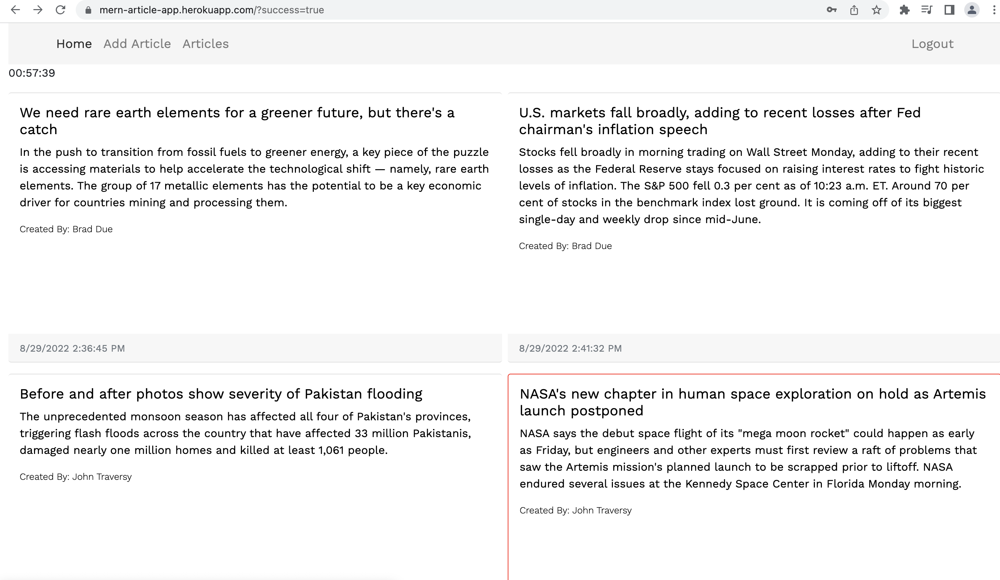

# News Media App

This is a MERN (MongoDB, Express, React, Node) app. In this project I built  a **N**ews **M**edia
**A**pp were authors of news articles can login, create, delete and update their articles and post them to the site. This app uses JWT Tokens which are sent inside cookies from the server to authorize and authenticate users (authors) of the app. To accomplish this task, passport-local and passport-jwt strategies are used.
In order to validate the fields in various forms such as registration, login, article creation and article update, the npm express-validator package is used. In the frontend, I use React. Within React I use the react-router-dom package which enables dynamic routing and avoids refreshing the page. For storing the articles and user information, MongoDB (NoSQL) database is used.

Below is a snapshot of the project.

## Instructions
It is presumed that you have already installed Node.js, MongoDB and Git on your device.
* Clone the app repository from GitHub.
* Open a terminal inside the root folder and install the Node required dependencies using "npm install".
* Open a terminal inside the client folder and install the React required dependencies using "npm install".
* In the Node terminal run "npm start".
* In the React terminal run "npm start".
* The app should succesfully load.

## Usage
This is a news app where users can read the posted topics.
It also provides an interface for content creators to post new articles and update/delete them as required.

## Tests
This app was tested manually.

## Future
More features such as handling passwords which are forgotten during user login will be added in the future.

  
  

